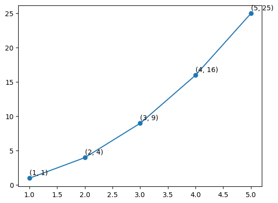
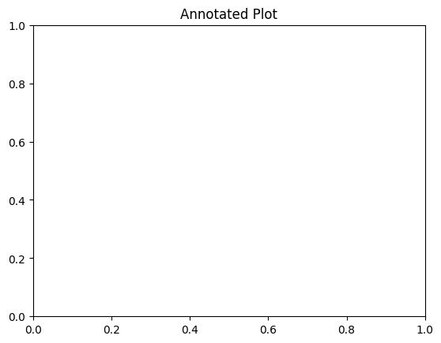
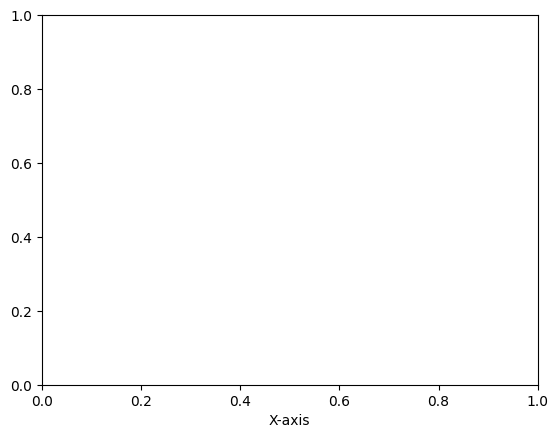
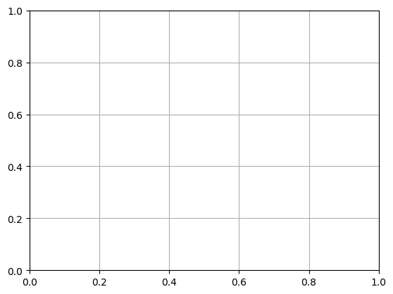

```python
#Adding annotations
```


```python
import matplotlib.pyplot as plt
```


```python
x = [1, 2, 3, 4, 5]
```


```python
y = [1, 4, 9, 16, 25]
```


```python
plt.plot(x, y, marker="o")
for i, j in zip(x, y):
    plt.text(i, j+0.5, f"({i}, {j})")
```


    

    


```python

plt.title("Annotated Plot")

```


    Text(0.5, 1.0, 'Annotated Plot')


    

    


```python
plt.xlabel("X-axis")

```


    Text(0.5, 0, 'X-axis')


    

    


```python
plt.ylabel("Y-axis")

```


    Text(0, 0.5, 'Y-axis')


    

    


```python
plt.grid()

```


    

    


```python
plt.show()
```


```python

```


---
**Score: 10**
