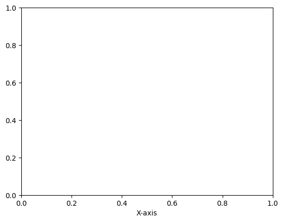

```python
#Basic Line Plot

```


```python
import matplotlib.pyplot as plt

```


```python
x = [1, 2, 3, 4, 5]
```


```python
y = [2, 3, 5, 7, 11]
```


```python
plt.plot(x, y, marker='o')
```


    [<matplotlib.lines.Line2D at 0x7f372d592fc0>]


    

    


```python
plt.title("Basic Line Plot")
```


    Text(0.5, 1.0, 'Basic Line Plot')


    

    


```python
plt.xlabel("X-axis")
```


    Text(0.5, 0, 'X-axis')


    

    


```python
plt.ylabel("Y-axis")
```


    Text(0, 0.5, 'Y-axis')


    

    


```python
plt.grid()
```


    

    


```python
plt.show()
```


```python

```


---
**Score: 10**
