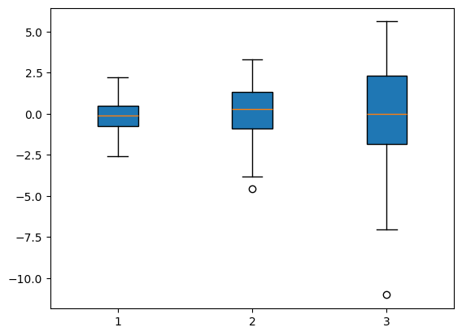
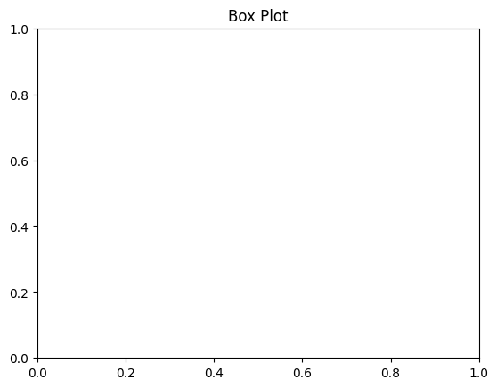
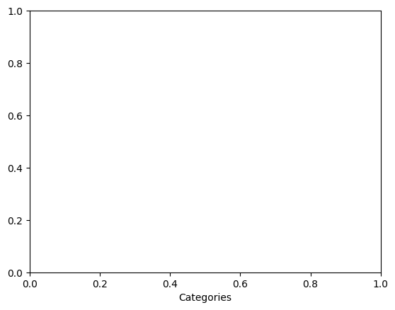
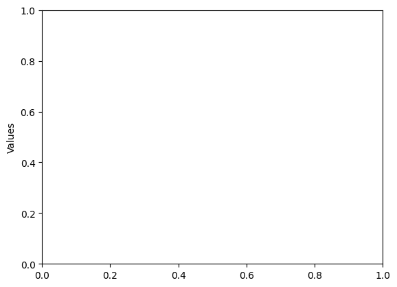

```python
#Box Plot
```


```python
import matplotlib.pyplot as plt
```


```python
import numpy as np
```


```python
data = [np.random.normal(0, std, 100) for std in range(1, 4)]
```


```python
plt.boxplot(data, vert=True, patch_artist=True)
```


    {'whiskers': [<matplotlib.lines.Line2D at 0x7f4e3c621eb0>,
      <matplotlib.lines.Line2D at 0x7f4e3c622150>,
      <matplotlib.lines.Line2D at 0x7f4e3c623110>,
      <matplotlib.lines.Line2D at 0x7f4e3c623410>,
      <matplotlib.lines.Line2D at 0x7f4e3c65c4d0>,
      <matplotlib.lines.Line2D at 0x7f4e3c65c7d0>],
     'caps': [<matplotlib.lines.Line2D at 0x7f4e3c622420>,
      <matplotlib.lines.Line2D at 0x7f4e3c622720>,
      <matplotlib.lines.Line2D at 0x7f4e3c623710>,
      <matplotlib.lines.Line2D at 0x7f4e3c623a10>,
      <matplotlib.lines.Line2D at 0x7f4e3c65ca70>,
      <matplotlib.lines.Line2D at 0x7f4e3c65cd70>],
     'boxes': [<matplotlib.patches.PathPatch at 0x7f4e3cea2570>,
      <matplotlib.patches.PathPatch at 0x7f4e3c622d50>,
      <matplotlib.patches.PathPatch at 0x7f4e3c65c0e0>],
     'medians': [<matplotlib.lines.Line2D at 0x7f4e3c622990>,
      <matplotlib.lines.Line2D at 0x7f4e3c623d10>,
      <matplotlib.lines.Line2D at 0x7f4e3c65cfe0>],
     'fliers': [<matplotlib.lines.Line2D at 0x7f4e3c622c90>,
      <matplotlib.lines.Line2D at 0x7f4e3c65c050>,
      <matplotlib.lines.Line2D at 0x7f4e3c65d280>],
     'means': []}


    

    


```python
plt.title("Box Plot")
```


    Text(0.5, 1.0, 'Box Plot')


    

    


```python
plt.xlabel("Categories")
```


    Text(0.5, 0, 'Categories')


    

    


```python
plt.ylabel("Values")

```


    Text(0, 0.5, 'Values')


    

    


```python
plt.show()
```


```python

```


---
**Score: 10**
