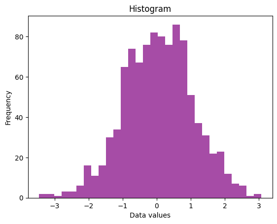

```python
#Histogram
```


```python
import matplotlib.pyplot as plt
```


```python
import numpy as np
```


```python
data = np.random.randn(1000)
plt.hist(data, bins=30, color="purple", alpha=0.7)
plt.title("Histogram")
plt.xlabel("Data values")
plt.ylabel("Frequency")
plt.show()
```


    

    


```python

```


---
**Score: 5**
