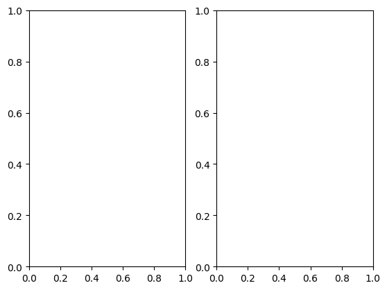

```python
#Subplots
```


```python
import matplotlib.pyplot as plt
```


```python
x = [1, 2, 3, 4, 5]
```


```python
y1 = [1, 4, 9, 16, 25]
```


```python
y2 = [1, 8, 27, 64, 125]
```


```python
fig, (ax1, ax2) = plt.subplots(1, 2)
```


    

    


```python
ax1.plot(x, y1, color="blue")
```


    [<matplotlib.lines.Line2D at 0x7f4ac5a42990>]


```python
ax1.set_title("Square")
```


    Text(0.5, 1.0, 'Square')


```python
ax2.plot(x, y2, color="green")
ax2.set_title("Cube")
```


    Text(0.5, 1.0, 'Cube')


```python
plt.suptitle("Subplots Example")
plt.show()
```


    <Figure size 640x480 with 0 Axes>


```python

```


---
**Score: 10**
