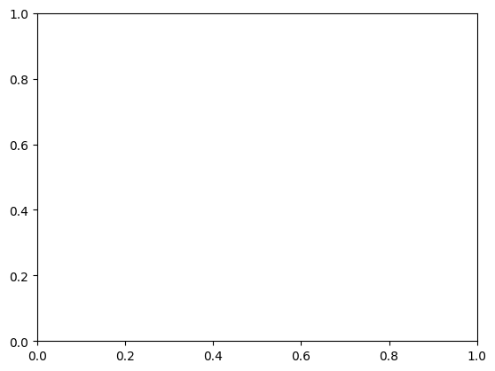

```python
#Creating table in plot
```


```python
import matplotlib.pyplot as plt

```


```python
data = [
    ["Alice", 24, "Engineer"],
    ["Bob", 27, "Data Scientist"],
    ["Charlie", 22, "Teacher"]
]
```


```python
columns = ("Name", "Age", "Occupation")
```


```python
fig, ax = plt.subplots()
```


    

    


```python
ax.axis("tight")
```


    (-0.05500000000000001,
     0.05500000000000001,
     -0.05500000000000001,
     0.05500000000000001)


```python
ax.axis("off")

```


    (-0.05500000000000001,
     0.05500000000000001,
     -0.05500000000000001,
     0.05500000000000001)


```python
table = ax.table(cellText=data, colLabels=columns, cellLoc="center", loc="center")

```


```python
plt.title("Simple Table Example")

```


    Text(0.5, 1.0, 'Simple Table Example')


    

    


```python
plt.show()
```


---
**Score: 10**
