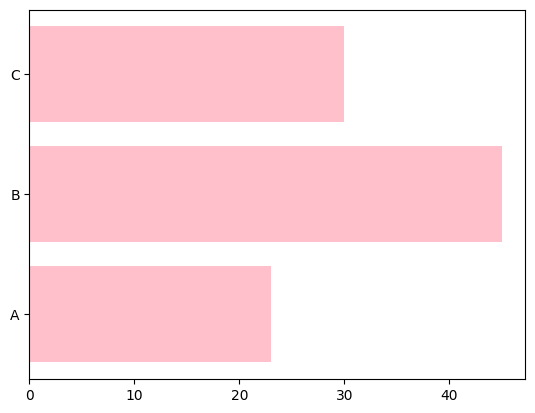
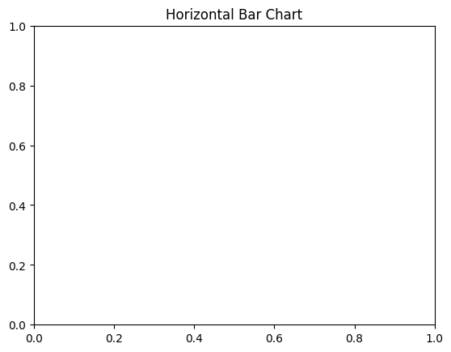
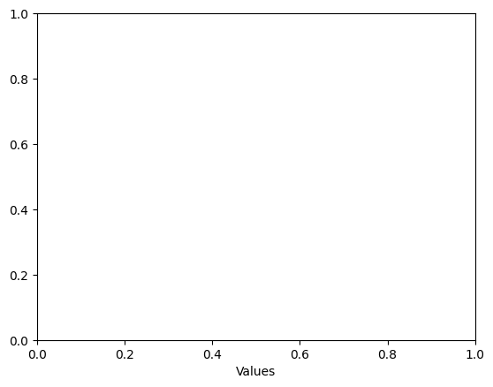
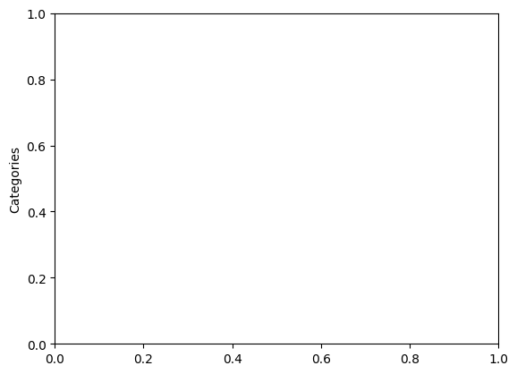

```python
# Horizontal Bar Chart
```


```python
import matplotlib.pyplot as plt
```


```python
# Data
```


```python
categories = ['A', 'B', 'C']
values = [23, 45, 30]
```


```python
# Plot
```


```python
plt.barh(categories, values, color='pink')
```


    <BarContainer object of 3 artists>


    

    


```python
plt.title("Horizontal Bar Chart")
```


    Text(0.5, 1.0, 'Horizontal Bar Chart')


    

    


```python
plt.xlabel("Values")
```


    Text(0.5, 0, 'Values')


    

    


```python
plt.ylabel("Categories")
```


    Text(0, 0.5, 'Categories')


    

    


```python
plt.show()
```


```python

```


---
**Score: 10**
