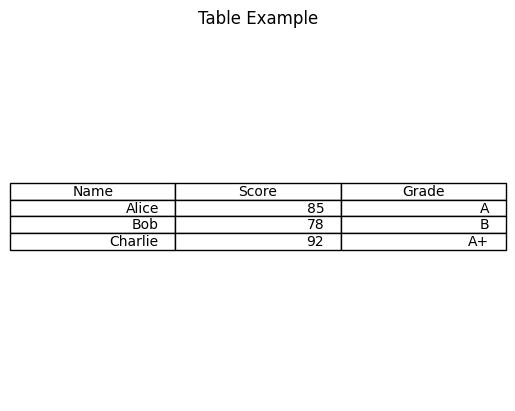

```python
#Table with Matplotlib
```


```python
import matplotlib.pyplot as plt
```


```python
# Data for table
```


```python
data = [['Alice', 85, 'A'],
        ['Bob', 78, 'B'],
        ['Charlie', 92, 'A+']]
```


```python
column_labels = ('Name', 'Score', 'Grade')
```


```python
# Plot
```


```python
fig, ax = plt.subplots()
ax.axis('tight')
ax.axis('off')
ax.table(cellText=data, colLabels=column_labels, loc='center')

plt.title("Table Example")
plt.show()
```


    

    


```python

```


---
**Score: 5**
