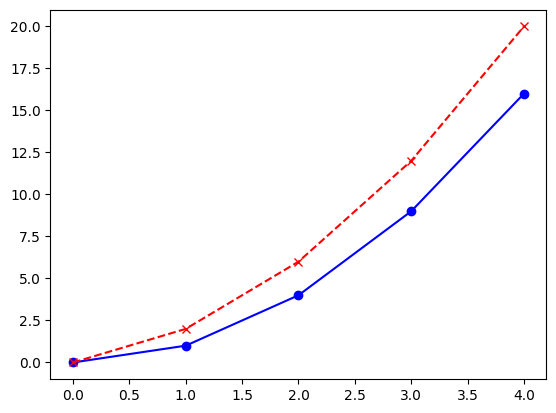
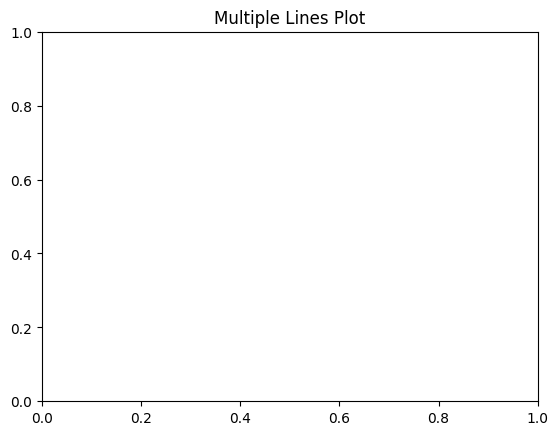
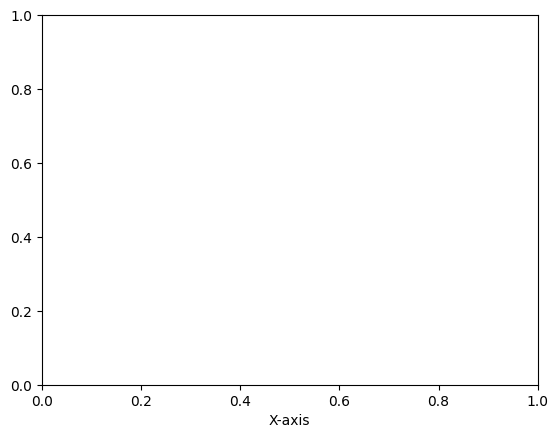
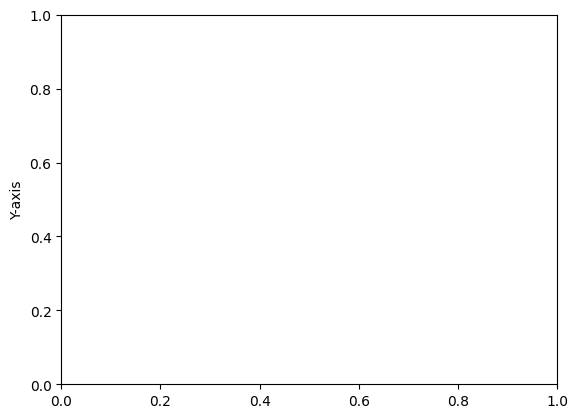
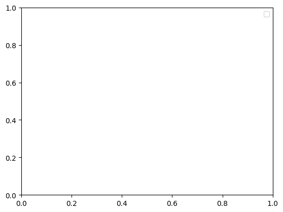

```python
#Line Plot with Multiple Lines
```


```python
import matplotlib.pyplot as plt
```


```python
# Data
```


```python
x = [0, 1, 2, 3, 4]
y1 = [0, 1, 4, 9, 16]
y2 = [0, 2, 6, 12, 20]
```


```python
# Plot
```


```python
plt.plot(x, y1, label="Line 1", color="blue", marker="o")
plt.plot(x, y2, label="Line 2", color="red", linestyle="--", marker="x")
```


    [<matplotlib.lines.Line2D at 0x7ff473ddf2c0>]


    

    


```python
plt.title("Multiple Lines Plot")
```


    Text(0.5, 1.0, 'Multiple Lines Plot')


    

    


```python
plt.xlabel("X-axis")
```


    Text(0.5, 0, 'X-axis')


    

    


```python
plt.ylabel("Y-axis")
```


    Text(0, 0.5, 'Y-axis')


    

    


```python
plt.legend()
plt.show()
```

    /tmp/ipykernel_28851/3208844177.py:1: UserWarning: No artists with labels found to put in legend.  Note that artists whose label start with an underscore are ignored when legend() is called with no argument.
      plt.legend()


    

    


```python

```


---
**Score: 10**
