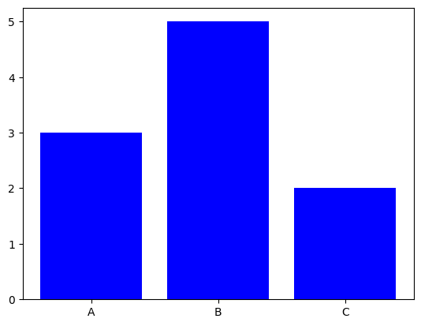

```python
#Stacked Bar Chart
```


```python
import matplotlib.pyplot as plt
```


```python
# Data
```


```python
categories = ['A', 'B', 'C']
values1 = [3, 5, 2]
values2 = [4, 6, 3]
```


```python
# Plot
```


```python
plt.bar(categories, values1, label="Dataset 1", color="blue")
```


    <BarContainer object of 3 artists>


    

    


```python
plt.bar(categories, values2, bottom=values1, label="Dataset 2", color="green")
```


    <BarContainer object of 3 artists>


    

    


```python
plt.title("Stacked Bar Chart")
```


    Text(0.5, 1.0, 'Stacked Bar Chart')


    

    


```python
plt.legend()
plt.show()
```

    /tmp/ipykernel_28382/3208844177.py:1: UserWarning: No artists with labels found to put in legend.  Note that artists whose label start with an underscore are ignored when legend() is called with no argument.
      plt.legend()


    

    


```python

```


---
**Score: 10**
