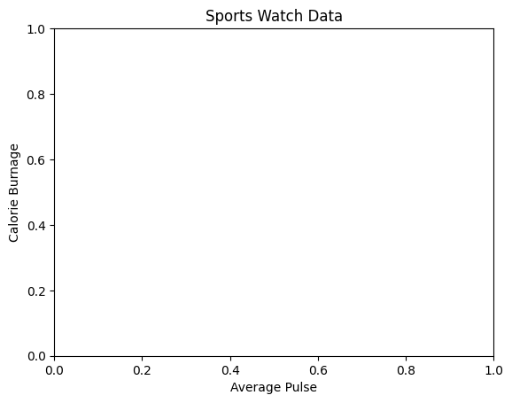
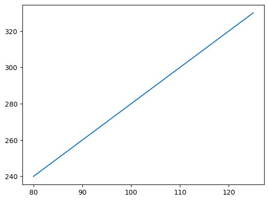
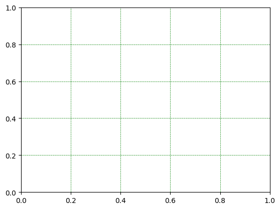

```python
#Set Line Properties for the Grid
```


```python
#properties of the grid, like this: grid(color = 'color', linestyle = 'linestyle', linewidth = number).
```


```python
import numpy as np
```


```python
import matplotlib.pyplot as plt
```


```python
x = np.array([80, 85, 90, 95, 100, 105, 110, 115, 120, 125])
```


```python
y = np.array([240, 250, 260, 270, 280, 290, 300, 310, 320, 330])
```


```python
plt.title("Sports Watch Data")
plt.xlabel("Average Pulse")
plt.ylabel("Calorie Burnage")
```


    Text(0, 0.5, 'Calorie Burnage')


    

    


```python
plt.plot(x, y)
```


    [<matplotlib.lines.Line2D at 0x7f44db8ad340>]


    

    


```python
plt.grid(color = 'green', linestyle = '--', linewidth = 0.5)
```


    

    


```python
plt.show()
```


```python

```


---
**Score: 10**
