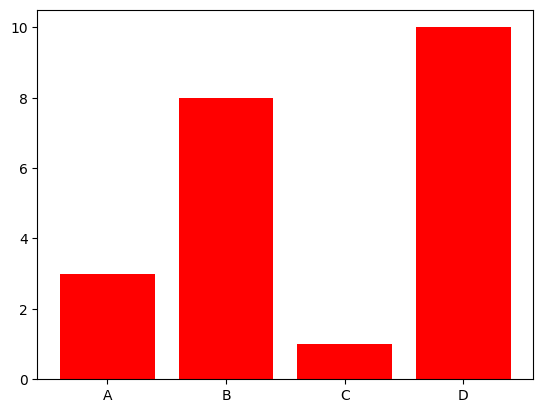

```python
#Bar Color matplotlib bars
```


```python
#The bar() and barh() take the keyword argument color to set the color of the bars:
```


```python
import matplotlib.pyplot as plt
```


```python
import numpy as np
```


```python
x = np.array(["A", "B", "C", "D"])
```


```python
y = np.array([3, 8, 1, 10])
```


```python
plt.bar(x, y, color = "red")
```


    <BarContainer object of 4 artists>


    

    


```python
plt.show()
```


```python

```


---
**Score: 5**
