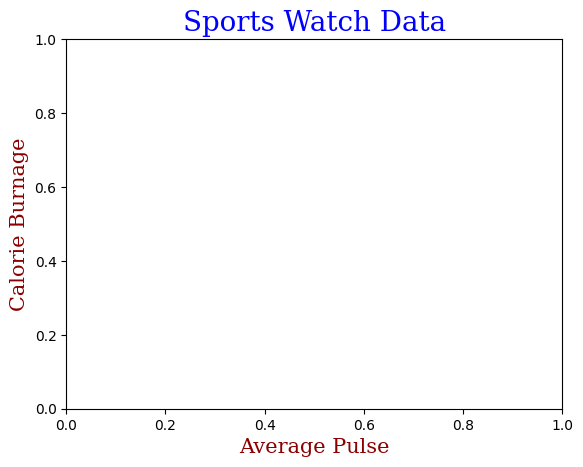

```python
#Set Font Properties for Title and Labels
```


```python
#fontdict parameter in xlabel(), ylabel(), and title() 
```


```python
import numpy as np
```


```python
import matplotlib.pyplot as plt
```


```python
#to set font properties for the title and labels.
```


```python
x = np.array([80, 85, 90, 95, 100, 105, 110, 115, 120, 125])
```


```python
y = np.array([240, 250, 260, 270, 280, 290, 300, 310, 320, 330])
```


```python
font1 = {'family':'serif','color':'blue','size':20}
```


```python
font2 = {'family':'serif','color':'darkred','size':15}
```


```python
plt.title("Sports Watch Data", fontdict = font1)
```


    Text(0.5, 1.0, 'Sports Watch Data')


    

    


```python
plt.title("Sports Watch Data", fontdict = font1)
plt.xlabel("Average Pulse", fontdict = font2)
plt.ylabel("Calorie Burnage", fontdict = font2)
```


    Text(0, 0.5, 'Calorie Burnage')


    

    


```python
plt.plot(x, y)
plt.show()
```


    

    


```python

```


---
**Score: 10**
