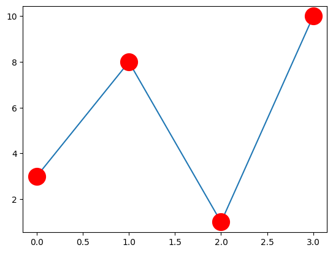

```python
#You can use the keyword argument marker to emphasize each point with a specified marker:
```


```python
import matplotlib.pyplot as plt
```


```python
#Set the color of both the edge and the face to red:
```


```python
import numpy as np
```


```python
ypoints = np.array([3, 8, 1, 10])
```


```python
plt.plot(ypoints, marker = 'o', ms = 20, mec = 'r', mfc = 'r')
plt.show()
```


    

    


```python

```


---
**Score: 5**
