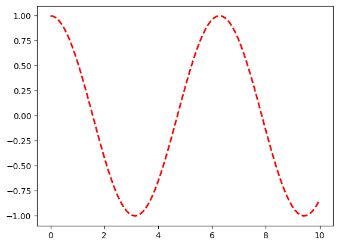

```python
#Line Plot with Multiple Lines and Legends
```


```python
import matplotlib.pyplot as plt
```


```python
import numpy as np
```


```python
# Data
```


```python
x = np.linspace(0, 10, 100)
```


```python
y1 = np.sin(x)
```


```python
y2 = np.cos(x)
```


```python
# Plotting
```


```python
plt.figure(figsize=(10, 6))
```


    <Figure size 1000x600 with 0 Axes>


    <Figure size 1000x600 with 0 Axes>


```python
plt.plot(x, y1, label='sin(x)', color='blue', linestyle='-', linewidth=2)
```


    [<matplotlib.lines.Line2D at 0x7fb0b19da4b0>]


    

    


```python
plt.plot(x, y2, label='cos(x)', color='red', linestyle='--', linewidth=2)
```


    [<matplotlib.lines.Line2D at 0x7fb0af3334d0>]


    

    


```python
# Customizing
```


```python
plt.title("Sine and Cosine Functions")
plt.xlabel("X-axis")
plt.ylabel("Y-axis")
plt.legend(loc='upper right')
plt.grid(True)
plt.show()
```

    /tmp/ipykernel_140256/3171771449.py:4: UserWarning: No artists with labels found to put in legend.  Note that artists whose label start with an underscore are ignored when legend() is called with no argument.
      plt.legend(loc='upper right')


    

    


```python

```


---
**Score: 10**
