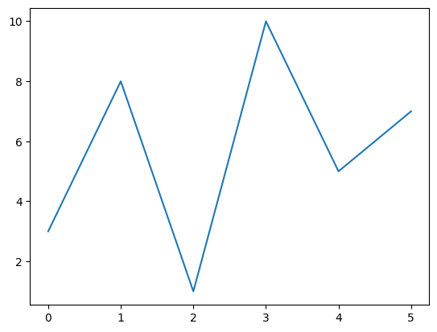

```python
#plot() function is used to draw points (markers) in a diagram.
```


```python
#By default, the plot() function draws a line from point to point.
```


```python
import matplotlib.pyplot as plt
```


```python
import numpy as np
```


```python
ypoints = np.array([3, 8, 1, 10, 5, 7])
```


```python
plt.plot(ypoints)
plt.show()
```


    

    


```python

```


---
**Score: 5**
