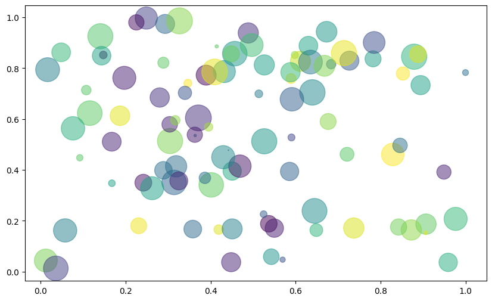
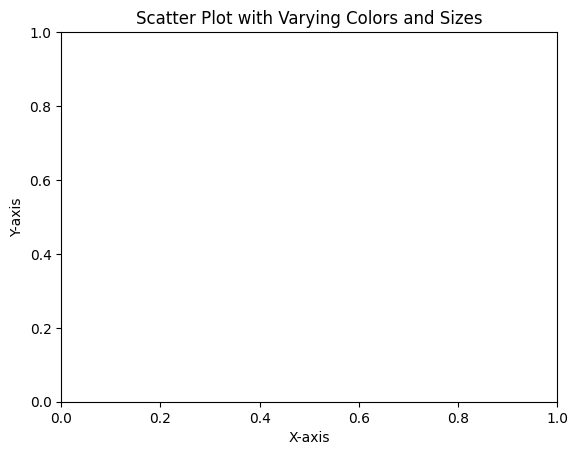

```python
# Scatter Plot with Color and Size Variations
```


```python
import matplotlib.pyplot as plt
```


```python
import numpy as np
```


```python
# Data
```


```python
x = np.random.rand(100)
```


```python
y = np.random.rand(100)
```


```python
colors = np.random.rand(100)
```


```python
sizes = 1000 * np.random.rand(100)
```


```python
# Plotting
```


```python
plt.figure(figsize=(10, 6))
scatter = plt.scatter(x, y, c=colors, s=sizes, alpha=0.5, cmap='viridis')
```


    

    


```python
# Customizing
```


```python
plt.colorbar(scatter, label='Color Intensity')
plt.title("Scatter Plot with Varying Colors and Sizes")
plt.xlabel("X-axis")
plt.ylabel("Y-axis")
plt.show()
```

    /tmp/ipykernel_140344/545948453.py:1: UserWarning: Adding colorbar to a different Figure <Figure size 1000x600 with 2 Axes> than <Figure size 640x480 with 0 Axes> which fig.colorbar is called on.
      plt.colorbar(scatter, label='Color Intensity')


    

    


```python

```


---
**Score: 10**
