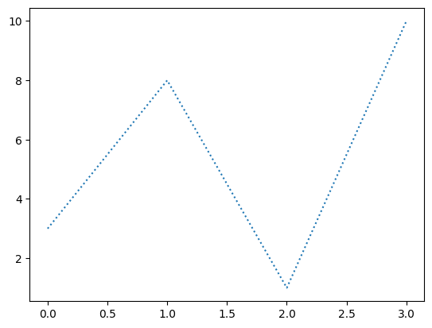

```python
#You can use the keyword argument linestyle, or shorter ls, to change the style of the plotted line:
```


```python
import matplotlib.pyplot as plt
```


```python
import numpy as np
```


```python
#points array
```


```python
ypoints = np.array([3, 8, 1, 10])
```


```python
#dotted linestyle
```


```python
plt.plot(ypoints, linestyle = 'dotted')
plt.show()
```


    

    


```python

```


---
**Score: 5**
