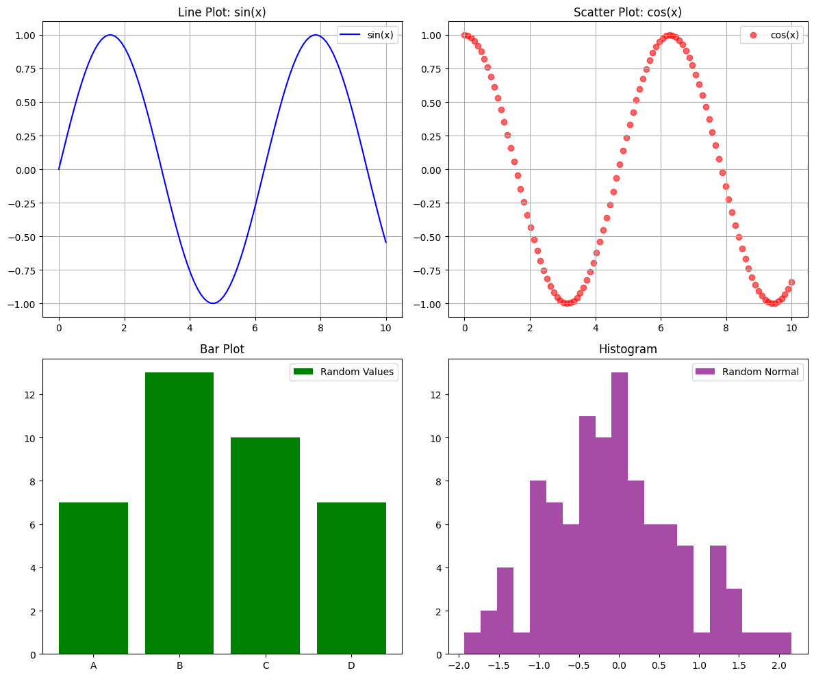

```python
#Multiple matplot display grid
```


```python
#line, scatter, bar, and histogram) with unique data for variety.
```


```python
import matplotlib.pyplot as plt
```


```python
import numpy as np
```


```python
# Generate data for different plots
```


```python
x = np.linspace(0, 10, 100)
```


```python
y1 = np.sin(x)
```


```python
y2 = np.cos(x)
```


```python
y3 = x**2
```


```python
y4 = np.random.normal(size=100)
```


```python
# Create a figure with multiple subplots (2 rows, 2 columns)
```


```python
# Line plot
```


```python
# Scatter plot
```


```python
# Bar plot
```


```python
# Histogram
```


```python
# Adjust layout to prevent overlap
```


```python
# Save the figure with all plots as a single image
```


```python
# Display the plots
```


```python
fig, axes = plt.subplots(2, 2, figsize=(12, 10))

axes[0, 0].plot(x, y1, color='blue', label='sin(x)')
axes[0, 0].set_title('Line Plot: sin(x)')
axes[0, 0].legend()
axes[0, 0].grid(True)


axes[0, 1].scatter(x, y2, color='red', label='cos(x)', alpha=0.6)
axes[0, 1].set_title('Scatter Plot: cos(x)')
axes[0, 1].legend()
axes[0, 1].grid(True)


categories = ['A', 'B', 'C', 'D']
values = [np.random.randint(5, 15) for _ in categories]
axes[1, 0].bar(categories, values, color='green', label='Random Values')
axes[1, 0].set_title('Bar Plot')
axes[1, 0].legend()


axes[1, 1].hist(y4, bins=20, color='purple', alpha=0.7, label='Random Normal')
axes[1, 1].set_title('Histogram')
axes[1, 1].legend()


plt.tight_layout()


plt.savefig("multiple_plots.png")

plt.show()

```


    

    


```python

```


```python

```


---
**Score: 20**
