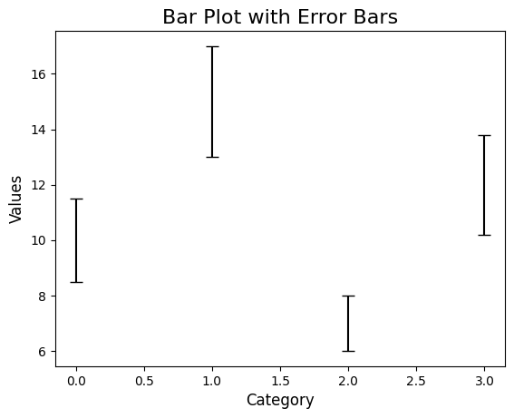

```python
#Bar Plot with Error Bars
```


```python
import seaborn as sns
```


```python
import matplotlib.pyplot as plt
```


```python
import pandas as pd
```


```python
import numpy as np
```


```python
# Create sample data
```


```python
data = pd.DataFrame({
    'Category': ['A', 'B', 'C', 'D'],
    'Values': [10, 15, 7, 12],
    'Error': [1.5, 2.0, 1.0, 1.8]  
})

```


```python
# Ensure the shape matches the Values
```


```python
# Plot
```


```python
plt.figure(figsize=(8, 6))
```


    <Figure size 800x600 with 0 Axes>


    <Figure size 800x600 with 0 Axes>


```python
# Using the correct error bar array matching the y-values.
```


```python
# Adding manual error bars matching the y-values (Optional).
```


```python
plt.errorbar(
    x=np.arange(len(data['Category'])),  # Bar positions
    y=data['Values'],
    yerr=data['Error'],
    fmt='none',  # No marker
    color='black',
    capsize=5
)
plt.title('Bar Plot with Error Bars', fontsize=16)
plt.xlabel('Category', fontsize=12)
plt.ylabel('Values', fontsize=12)
plt.show()
```


    

    


```python

```


```python

```


---
**Score: 15**
