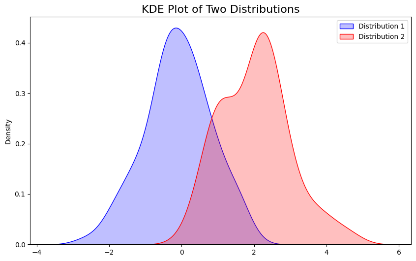

```python
#KDE Plot with Multiple Distributions
```


```python
import seaborn as sns
```


```python
import numpy as np
```


```python
import matplotlib.pyplot as plt
```


```python
# Create sample data
```


```python
np.random.seed(42)
data1 = np.random.normal(loc=0, scale=1, size=100)
data2 = np.random.normal(loc=2, scale=1, size=100)
```


```python
# Plot
```


```python
plt.figure(figsize=(10, 6))
sns.kdeplot(data1, color='blue', shade=True, label='Distribution 1')
sns.kdeplot(data2, color='red', shade=True, label='Distribution 2')
plt.title('KDE Plot of Two Distributions', fontsize=16)
plt.legend()
plt.show()
```

    /tmp/ipykernel_40811/4107425471.py:2: FutureWarning: 
    
    `shade` is now deprecated in favor of `fill`; setting `fill=True`.
    This will become an error in seaborn v0.14.0; please update your code.
    
      sns.kdeplot(data1, color='blue', shade=True, label='Distribution 1')
    /tmp/ipykernel_40811/4107425471.py:3: FutureWarning: 
    
    `shade` is now deprecated in favor of `fill`; setting `fill=True`.
    This will become an error in seaborn v0.14.0; please update your code.
    
      sns.kdeplot(data2, color='red', shade=True, label='Distribution 2')


    

    


```python

```


---
**Score: 5**
