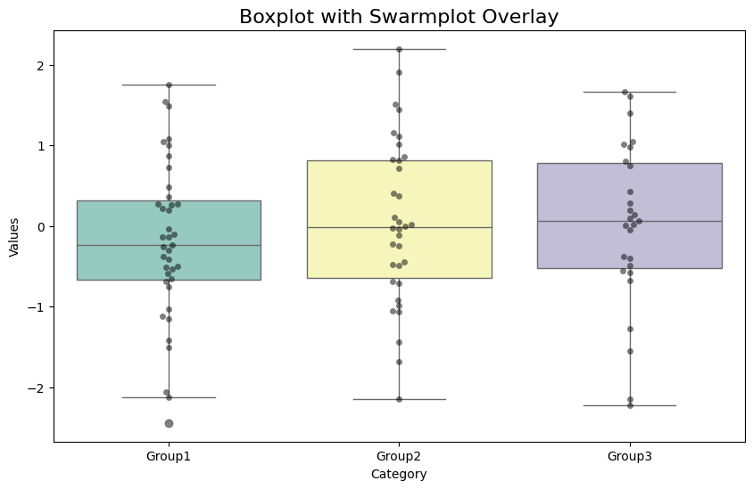

```python
#Boxplot with Swarmplot Overlay
```


```python
import seaborn as sns
```


```python
import matplotlib.pyplot as plt
```


```python
import numpy as np
```


```python
import pandas as pd
```


```python
# Create sample data
```


```python
np.random.seed(0)
```


```python
df = pd.DataFrame({
    'Category': np.random.choice(['Group1', 'Group2', 'Group3'], 100),
    'Values': np.random.randn(100)
})
```


```python
# Plot
```


```python
plt.figure(figsize=(10, 6))
sns.boxplot(x='Category', y='Values', data=df, palette='Set3')
sns.swarmplot(x='Category', y='Values', data=df, color='black', alpha=0.5)
plt.title('Boxplot with Swarmplot Overlay', fontsize=16)
plt.show()

```

    /tmp/ipykernel_40721/1840540330.py:2: FutureWarning: 
    
    Passing `palette` without assigning `hue` is deprecated and will be removed in v0.14.0. Assign the `x` variable to `hue` and set `legend=False` for the same effect.
    
      sns.boxplot(x='Category', y='Values', data=df, palette='Set3')


    

    


```python

```


---
**Score: 10**
