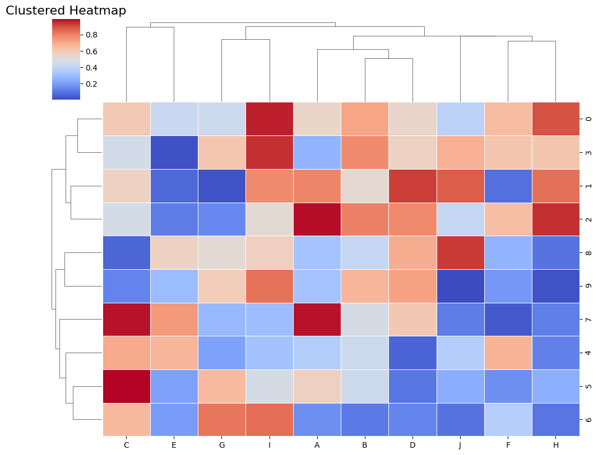

```python
#Clustered Heatmap
```


```python
import seaborn as sns
```


```python
import numpy as np
```


```python
import pandas as pd
```


```python
import matplotlib.pyplot as plt
```


```python
# Generate sample data
```


```python
np.random.seed(0)
```


```python
data = pd.DataFrame(np.random.rand(10, 10), columns=list('ABCDEFGHIJ'))
```


```python
# Plot
```


```python
sns.clustermap(data, cmap='coolwarm', linewidths=0.5, figsize=(10, 8), dendrogram_ratio=(.1, .2))
plt.title('Clustered Heatmap', fontsize=16)
plt.show()

```


    

    


```python

```


---
**Score: 10**
