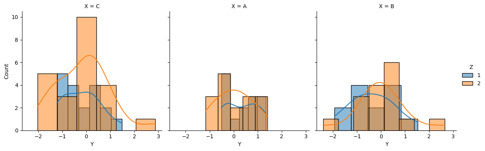

```python
#FacetGrid with Custom Plots
```


```python
import seaborn as sns
```


```python
import pandas as pd
```


```python
import matplotlib.pyplot as plt
```


```python
import numpy as np
```


```python
# Create sample data
```


```python
df = pd.DataFrame({
    'X': np.random.choice(['A', 'B', 'C'], 100),
    'Y': np.random.randn(100),
    'Z': np.random.choice([1, 2], 100)
})
```


```python
# Plot
```


```python
g = sns.FacetGrid(df, col='X', hue='Z', height=4)
g.map(sns.histplot, 'Y', kde=True)
g.add_legend()
plt.show()

```


    

    


```python

```


---
**Score: 10**
