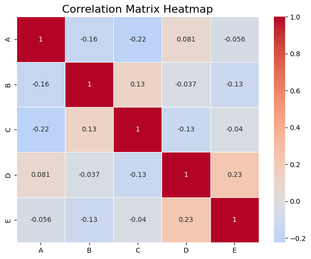

```python
#Heatmap of Correlation Matrix
```


```python
import seaborn as sns
```


```python
import numpy as np
```


```python
import pandas as pd
```


```python
import matplotlib.pyplot as plt
```


```python
# Generate random data
```


```python
np.random.seed(42)
```


```python
data = pd.DataFrame(np.random.rand(100, 5), columns=list('ABCDE'))
```


```python
# Compute the correlation matrix
```


```python
corr = data.corr()
```


```python
# Plot the heatmap
```


```python
plt.figure(figsize=(8, 6))
sns.heatmap(corr, annot=True, cmap='coolwarm', center=0, linewidths=0.5)
plt.title('Correlation Matrix Heatmap', fontsize=16)
plt.show()

```


    

    


```python

```


---
**Score: 10**
