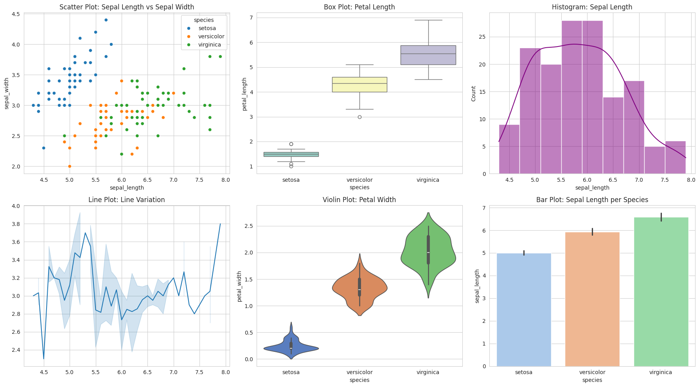

```python
#various plots such as scatter plots, bar plots, box plots, and histograms
```


```python
#And display them in a grid layout using matplotlib's plt.subplots()
```


```python
import seaborn as sns
```


```python
import matplotlib.pyplot as plt
```


```python
from sklearn.datasets import load_iris
```


```python
# Load a sample dataset (Iris dataset)
```


```python
iris = load_iris()
```


```python
data = sns.load_dataset("iris")
```


```python
# Set a style for the plots
```


```python
sns.set_style("whitegrid")
```


```python
# Initialize a grid of plots with `plt.subplots()`
```


```python
# 2 rows, 3 columns
```


```python
# Scatter Plot
```


```python
# Box Plot
```


```python
# Histogram
```


```python
# Pair Plot in a Small Area
```


```python
# Violin Plot
```


```python
# Bar Plot
```


```python
# Adjust layout to prevent overlap
```


```python
# Show the plots
```


```python
fig, axes = plt.subplots(2, 3, figsize=(18, 10)) 

# Scatter Plot
sns.scatterplot(
    x=data["sepal_length"],
    y=data["sepal_width"],
    hue=data["species"],
    ax=axes[0, 0]
).set_title("Scatter Plot: Sepal Length vs Sepal Width")

# Box Plot
sns.boxplot(
    x="species",
    y="petal_length",
    data=data,
    ax=axes[0, 1],
    palette="Set3"
).set_title("Box Plot: Petal Length")

# Histogram
sns.histplot(
    data=data["sepal_length"],
    kde=True,
    ax=axes[0, 2],
    color="purple"
).set_title("Histogram: Sepal Length")

# Pair Plot in a Small Area
sns.lineplot(
    x=iris.data[:, 0],
    y=iris.data[:, 1],
    ax=axes[1, 0]
).set_title("Line Plot: Line Variation")

# Violin Plot
sns.violinplot(
    x="species",
    y="petal_width",
    data=data,
    ax=axes[1, 1],
    palette="muted"
).set_title("Violin Plot: Petal Width")

# Bar Plot
sns.barplot(
    x="species",
    y="sepal_length",
    data=data,
    ax=axes[1, 2],
    palette="pastel"
).set_title("Bar Plot: Sepal Length per Species")

# Adjust layout to prevent overlap
plt.tight_layout()

# Show the plots
plt.show()

```

    /tmp/ipykernel_42908/3497895282.py:12: FutureWarning: 
    
    Passing `palette` without assigning `hue` is deprecated and will be removed in v0.14.0. Assign the `x` variable to `hue` and set `legend=False` for the same effect.
    
      sns.boxplot(
    /tmp/ipykernel_42908/3497895282.py:36: FutureWarning: 
    
    Passing `palette` without assigning `hue` is deprecated and will be removed in v0.14.0. Assign the `x` variable to `hue` and set `legend=False` for the same effect.
    
      sns.violinplot(
    /tmp/ipykernel_42908/3497895282.py:45: FutureWarning: 
    
    Passing `palette` without assigning `hue` is deprecated and will be removed in v0.14.0. Assign the `x` variable to `hue` and set `legend=False` for the same effect.
    
      sns.barplot(


    

    


```python

```


```python

```


---
**Score: 20**
