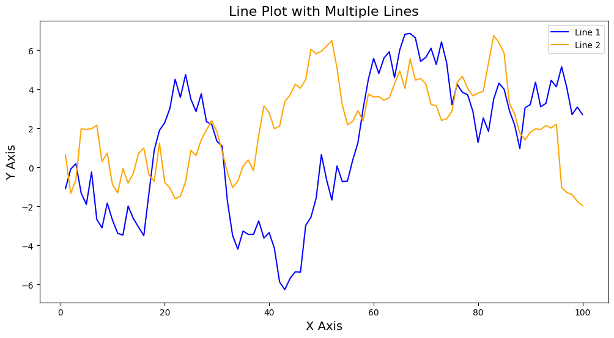

```python
#Line Plot with Multiple Lines
```


```python
import seaborn as sns
```


```python
import matplotlib.pyplot as plt
```


```python
import pandas as pd
```


```python
import numpy as np
```


```python
# Create sample data
```


```python
np.random.seed(123)
```


```python
df = pd.DataFrame({
    'X': range(1, 101),
    'Y1': np.cumsum(np.random.randn(100)),
    'Y2': np.cumsum(np.random.randn(100))
})
```


```python
# Plot
```


```python
plt.figure(figsize=(12, 6))
sns.lineplot(x='X', y='Y1', data=df, label='Line 1', color='blue')
sns.lineplot(x='X', y='Y2', data=df, label='Line 2', color='orange')
plt.title('Line Plot with Multiple Lines', fontsize=16)
plt.xlabel('X Axis', fontsize=14)
plt.ylabel('Y Axis', fontsize=14)
plt.legend()
plt.show()

```


    

    


```python

```


---
**Score: 10**
