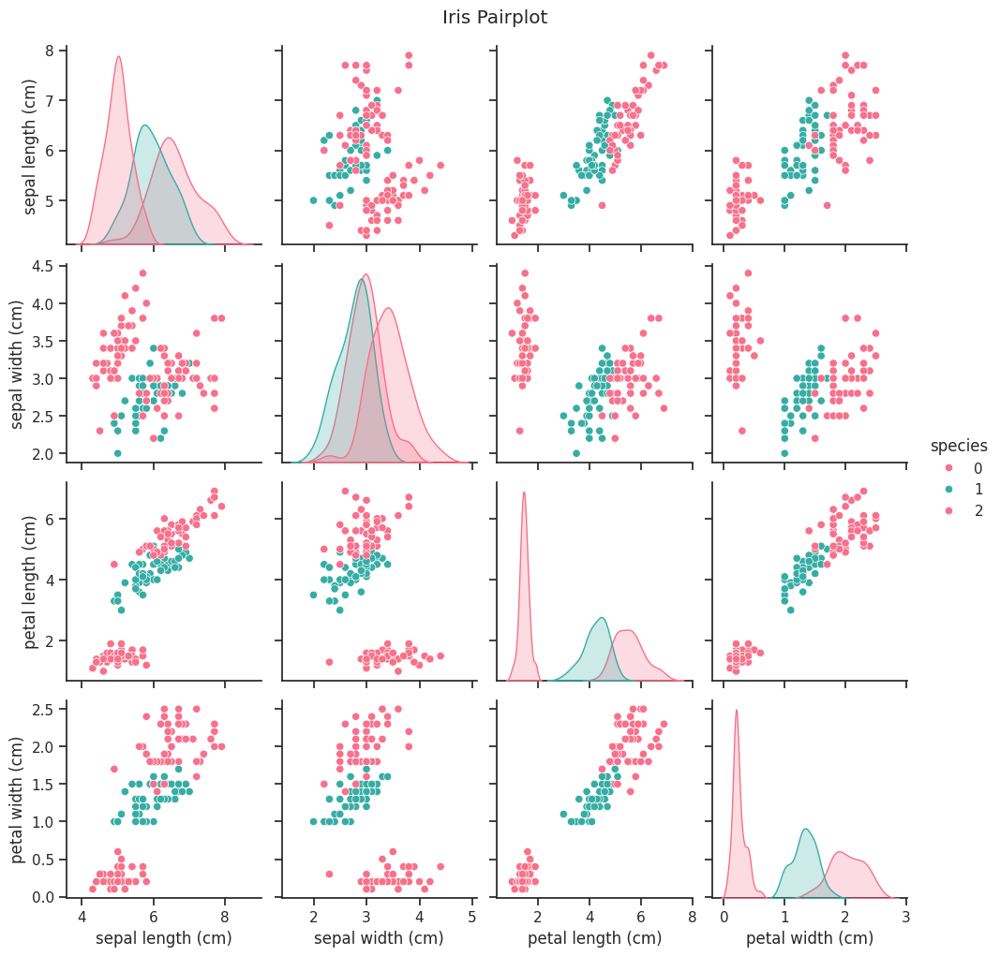

```python
#Pair Plot with Custom Palette and Kind
```


```python
from sklearn.datasets import load_iris
```


```python
#!pip install scikit-learn
```


```python
import pandas as pd
```


```python
import seaborn as sns
```


```python
import matplotlib.pyplot as plt
```


```python
# Load the iris dataset
```


```python
iris = load_iris()
```


```python
iris_df = pd.DataFrame(data=iris.data, columns=iris.feature_names)
```


```python
iris_df['species'] = iris.target
```


```python
# Pairplot
```


```python
sns.set(style="ticks")
g = sns.pairplot(iris_df, hue="species", palette="husl", kind='scatter', diag_kind='kde')
g.fig.suptitle('Iris Pairplot', y=1.02)
plt.show()
```


    

    


```python

```


```python

```


```python

```


---
**Score: 15**
