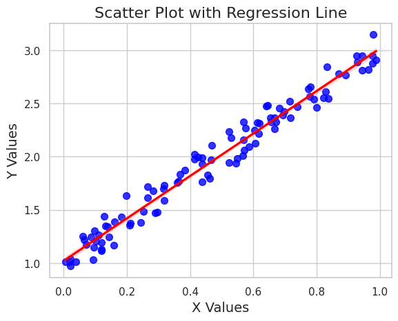

```python
#Scatter Plot with Regression Line and Customizations
```


```python
import seaborn as sns
```


```python
#!pip install seaborn
```


```python
import matplotlib.pyplot as plt
```


```python
import numpy as np
```


```python
import pandas as pd
```


```python
# Create a sample dataset
```


```python
np.random.seed(0)
```


```python
x = np.random.rand(100)
```


```python
y = 2 * x + 1 + np.random.randn(100) * 0.1
```


```python
data = pd.DataFrame({'x': x, 'y': y})
```


```python
# Plot
```


```python
sns.set(style="whitegrid")
```


```python
plt.figure(figsize=(10, 6))
```


    <Figure size 1000x600 with 0 Axes>


    <Figure size 1000x600 with 0 Axes>


```python
sns.regplot(x='x', y='y', data=data, color='blue', marker='o', scatter_kws={'s': 50}, line_kws={'color': 'red'})
plt.title('Scatter Plot with Regression Line', fontsize=16)
plt.xlabel('X Values', fontsize=14)
plt.ylabel('Y Values', fontsize=14)
plt.show()
```


    

    


```python

```


```python

```


```python

```


---
**Score: 15**
