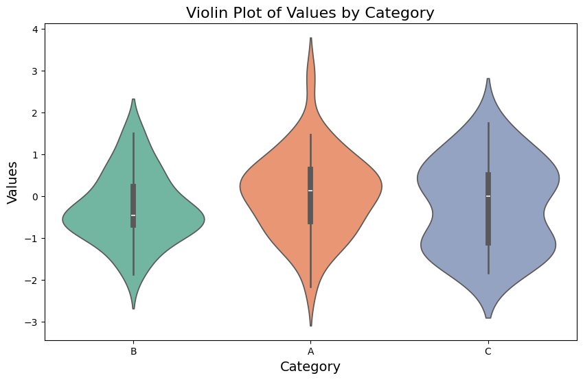

```python
#Violin Plot with Multiple Categories
```


```python
import seaborn as sns
```


```python
import matplotlib.pyplot as plt
```


```python
import numpy as np
```


```python
import pandas as pd
```


```python
# Create sample data
```


```python
np.random.seed(10)
```


```python
df = pd.DataFrame({
    "Category": np.random.choice(["A", "B", "C"], 100),
    "Values": np.random.randn(100)
})
```


```python
# Plot
```


```python
plt.figure(figsize=(10, 6))
sns.violinplot(x='Category', y='Values', data=df, palette='Set2')
plt.title('Violin Plot of Values by Category', fontsize=16)
plt.xlabel('Category', fontsize=14)
plt.ylabel('Values', fontsize=14)
plt.show()

```

    /tmp/ipykernel_40607/1577404520.py:2: FutureWarning: 
    
    Passing `palette` without assigning `hue` is deprecated and will be removed in v0.14.0. Assign the `x` variable to `hue` and set `legend=False` for the same effect.
    
      sns.violinplot(x='Category', y='Values', data=df, palette='Set2')


    

    


```python

```


---
**Score: 10**
